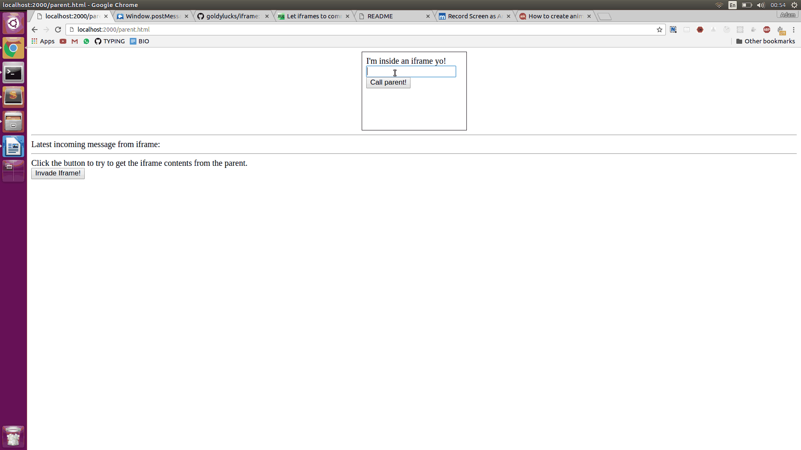

# iframe
Small demo of communicating between iframe and parent

## Demo


## try it out
```bash
$ git clone git@github.com:goldylucks/iframe.git
$ cd iframe
$ python3 -m http.server 2000 # open webserver at port 2000 for parent
$ python3 -m http.server 2001 # open webserver at port 2001 for iframe child
```
open browser at localhost:2000